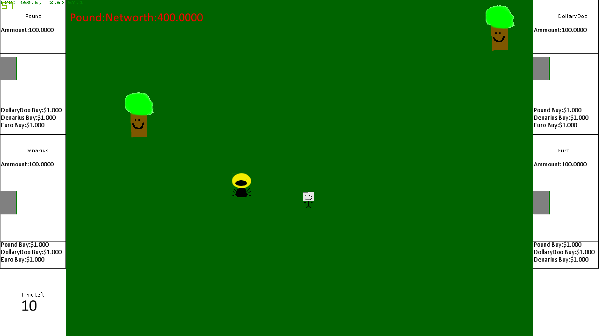

# NumbersOrDie

This is a basic 2D game I made in my first year of uni back in 2016. 



## Preparing
* You will need FPC
* On windows you will need mingw and fpc

## Compiling
Note in windows you will need to open in mingw

You will have to source your own ```PassiveBackgroundMusic.wav``` and ```ChaosBackgroundMusic.wav``` and place them in ```/Game/Resources/sounds```

### Compiling Game 
```
cd Game
./build.sh
```
You might have to copy all of the ```.dll``` in ```Game/lib/win32``` ```/ into ```Game/bin/Debug```

### Compiling Server
```
cd Server
./build.sh
```

You might have to copy all of the ```.dll``` in ```Server/lib/win32``` ```/ into ```Server/bin/Debug```

## Running

### Servers broken Im not fixing code from 2016
### Game go to
Open  ```Game/bin/debug/Game.exe```.

### Controls
* Move with arrow keys
* Shoot by selecting a money by using 1,2,3,4 then press space this will shoot your money
* Converting Money press the money your are converting from and the money you are converting too then press tab to clear a selection only double tap 1 and press tab
* Press R to reset

### What the hell is happening?
* How is the currency value for converting determined? 
	* Everyone in the game has a random amount of each type of money the more money there is the less value it has vs other kinds of money.
* What happens when I shoot?
	* You shoot that money and if it hits an enemy you get some of their kind of money PLUS all of your money back if you miss that money is lost this will lead to that kind of money being worth more but you will have less.
* How do I lose?
	* when your networth is below 0
* What the fuck is my networth? 
	* Your networth is the total amount of money you have in the base currency.
* What the fucking hell is the base currency?
	* The base currency is the money which is worth the most vs the other money kinds.
* What the fuck?
	* yeah.
